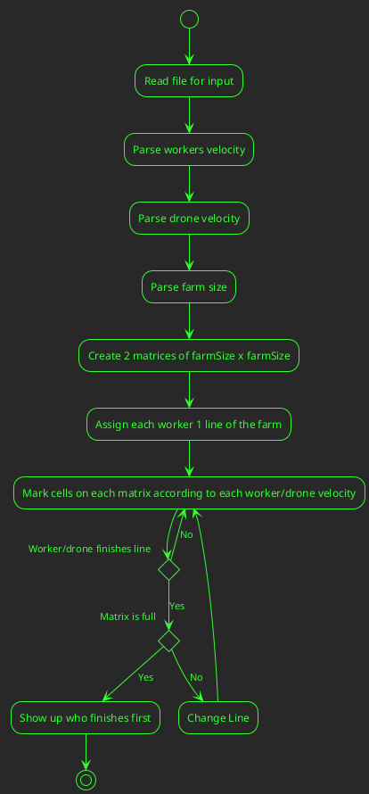

```plantuml
@startuml

!theme crt-green

(*) --> "Read file for input"
--> "Parse workers velocity"
--> "Parse drone velocity"
--> "Parse farm size"
--> "Create 2 matrices of farmSize x farmSize"
--> "Assign each worker 1 line of the farm"
--> "Mark cells on each matrix according to each worker/drone velocity"
if "Worker/drone finishes line" then
    --> [Yes] if "Matrix is full" then
        --> [Yes] "Show up who finishes first"
        --> (*)
    else
        --> [No] "Change Line"
        --> "Mark cells on each matrix according to each worker/drone velocity"
    endif
else
    --> [No] "Mark cells on each matrix according to each worker/drone velocity"
endif

@enduml
```
